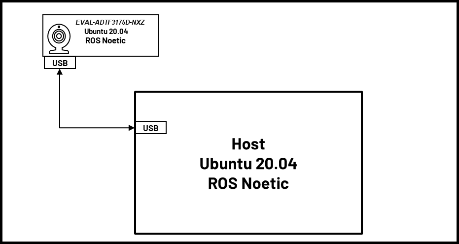
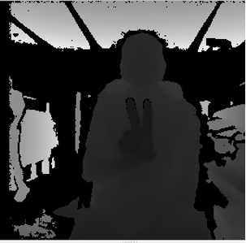
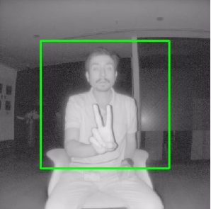
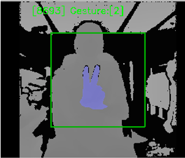

<h1 style="text-align: center;" > Analog Devices 3DToF Gesture Recognition</h1>

---
# Overview
The Analog Devices 3DToF Gesture Recognition package is an ROS (Robot Operating System) solution designed for real-time Hand Gesture Reognition. Leveraging the power of deep learning, this package processes depth images captured by ADI's Time of Flight (ToF) sensor to accurately recognize and publish one of 18 distinct gestures. At the heart of the recognition module is a Convolutional Neural Network (CNN), which ensures the system to operate seamlessly at 5 frames per second (FPS) on the EVAL-ADTF3175D-NXZ platform.



[](http://wiki.ros.org/noetic) [](https://releases.ubuntu.com/focal/) [](LICENSE)  

---
# Hardware

- [EVAL-ADTF3175D-NXZ Module](https://www.analog.com/en/design-center/evaluation-hardware-and-software/evaluation-boards-kits/EVAL-ADTF3175.html#eb-overview)
- USB type-c to type-A cable - with 5gbps data speed support
- Host laptop with intel i5 of higher cpu running Ubuntu-20.04LTS

 :memo: _Note_: Refer the [EVAL-ADTF3175D-NXZ User Guide](https://wiki.analog.com/resources/eval/user-guides/eval-adtf3175d-nxz) to ensure the Eval module has adequate power supply during operation.

The image below shows the connection diagram of the setup :

<div style="text-align:center"></div>

> :memo:
> **ADSD3500 Firmware :**  
> Make sure the sensor is flashed with the release 5.2.0 of ADSD3500 Firmware
  >**:warning: <span style="color:red"> ADI 3DToF Gesture Recognition does not support CR/DV series.**</span> 
> 
> Follow the below instructions to read the FW version  
>1. Login to the EVAL-ADTF3175D-NXZ module using ssh. On the Host machine open the “Terminal” and run the following command to ssh to the device.  
>    ```bash
>       $ ssh analog@10.43.0.1
>          Username: analog   
>          Password: analog     
>    ```  
>2. Run the follwing commands
>   ```bash 
>       $ cd ~/Workspace/Tools/ctrl_app
>       $ ./ctrl_app
>   ```
> The output would look like below,  
>   **V4L2 custom control interface app version: 1.0.1**  
>   **59 31**   
>   **<span style="color:red">**05 02 00 00**</span> 61 35 39 61 66 61 64 36 64 36 63   38 65 37 66 62 31 35 33 61 32 64 62 38 63 64 38 38 34 30 33 35 39 66 31 37 31 39 35 61**   
>   **59 31**   
> The first four bytes in the third line represents the FW version. For example for the output above, the version is **5.2.0.0**  
  
> If the firware version is older than this please upgrade the FW using the following instructions

>1. Install ADI ToF SDK release [v5.0.0](https://github.com/analogdevicesinc/ToF/releases/tag/v5.0.0)  
>2. After installing goto the inastallation folder and run the following commands to download the image   
>   ```bash
>       $ cd ~/Analog\ Devices/ToF_Evaluation_Ubuntu_ADTF3175D-Relx.x.x/image.
>       $ chmod +x get_image.sh and ./get_image.sh.
>   ```
>-   Latest image will be downloaded at ./image path as NXP-Img-Relx.x.x-ADTF3175D-.zip. Extract this folder using unzip NXP-Img-Relx.x.x-ADTF3175D-.zip command.
>
>-   This folder contains the NXP image and ADSD3500 firmware(Fw_Update_x.x.x.bin).  

>3. Run the following command to copy the Fimware to the NXP device
>   ```bash
>       $ scp Fw_Update_5.2.0.bin analog@10.43.0.1:/home/analog/Workspace
>          Username: analog 
>          Password: analog
>   ```    
>4. Now login to the device and run the Firmware upgrade command.  
>**:warning: <span style="color:red"> Do not interrupt/abort while the upgrade is in progress.Doing this may corrupt the module.**</span>  
>   ```bash
>        $ ssh analog@10.43.0.1 
>           Username: analog 
>           Password: analog   
>        $ cd Workspace/ToF/build/examples/data_collect/
>        $ ./data_collect --fw ~/Workspace/Fw_Update_x.x.x.bin config/config_adsd3500_adsd3100.json
>   ```  
>-  Reboot the board after the successful operation.  
           
For details refer to [EVAL-ADTF3175D-NXZ NVM upgrade guide](https://wiki.analog.com/resources/eval/user-guides/eval-adtf3175d-nxz-upgrade-firmware)

---  
# Using a Pre-configured ISO Image for Gesture Recognition on the EVAL-ADTF3175D-NXZ:
1. Download and install the latest version of *ADI 3DToF Gesture Recognition* from the Release pages.

2. After installing the software, go to the installation folder(~/Analog Devices/ADI3DToFGestureRecogniton-Relx.x.x) and run the get_image.sh script. This script will download the custom Ubuntu 20.04 image for the EVAL-ADTF3175D-NXZ. 

3.	Flash .img file to the SD card, follow steps in this link [EVAL-ADTF3175D-NXZ Users Guide](https://wiki.analog.com/resources/eval/user-guides/eval-adsd3100-nxz/flashing_image_instructions) to flash the .img file to SD card.
    
    *Note*: This image contains the necessary software and code to start using the ROS node. The source code for the ```adi_3dtof_gesture_recognition``` can be found in ```/home/analog/catkin_ws/src/```

4.	Follow the instructions below to run the *adi_3dtof_gesture_recognition* application on the EVAL-ADTF3175D-NXZ module.

5.	Connect the EVAL-ADTF3175D-NXZ module to the PC using the USB3.0 cable and wait for the network to come up. By default, the device ip is set to **10.43.0.1**. Refer to [EVAL-ADTF3175D-NXZ Startup Guide](https://wiki.analog.com/eval-adtf3175d-nxz-startup#software_download) for details.

6.	Login to the EVAL-ADTF3175D-NXZ module using ssh. On the Host machine open the “Terminal” and run the following command to ssh to the device.
    ```bash
    $ ssh analog@10.43.0.1 
      Username: analog 
      Password: analog   
    ```

    *Note*: If you do not have a Linux Host machine, then install Windows Subsystem for Linux(WSL) and Ubuntu 20.04 on Windows. 
    Refer to this [link](https://learn.microsoft.com/en-us/windows/wsl/install) for instructions.


>    :memo:  
> 1. **Setting Date/Time:**  
>Make sure the Date/Time is set properly before compiling and running the application. Connecting to a WiFi network would make sure the Date/Time is set properly. The custom Ubuntu 20.04 image is configured to connect to a network with following SSID and Password by default.  
    ```
    SSID : ADI  
    Password: analog123  
    ```  
>You can either setup a network with the above properties or configure the Device to connect to any available network.  
>Alternatively, the Host machine can be setup as a local NTP server and the devices can be configured to update Date/Time using the Host machine.  
>Refer to below links for setting and configuring NTP on Ubuntu machines.
>-  https://ubuntuforums.org/showthread.php?t=862620  
>-  https://timetoolsltd.com/ntp/how-to-install-and-configure-ntp-on-linux/  

> 2. The ROS Noetic and dependent packages are already installed in the EVAL-ADTF3175D-NXZ image and the source code for the *adi_3dtof_gesture_recognition* is present in `/home/analog/catkin_ws/src/` folder. The package is also pre-built, hence there is no need to build the package.  
>    If the source files are modified, then use the following commands to build the package.  
>>```bash
>>$ cd ~/catkin_ws/  
>> $ catkin_make -DCMAKE_BUILD_TYPE=RELEASE -j2  
>>```
>
>    Note: `/home/analog/catkin_ws/` is set up as the catkin workspace and this workspace is already sourced in the `~/.bashrc`

7.	Running the ROS Node in EVAL-ADTF3175D-NXZ module:

    On the EVAL-ADTF3175D-NXZ device, the ROS Master is set to the IP address of the Host machine, hence it is required to run `roscore` on the Host machine (*applicable only to Linux host*).

    On the Linux Host, open a terminal and run the following command
    ```bash
    $ roscore
    ```
    On the Device:
    ```bash
    $ roslaunch adi_3dtof_gesture_recognition adi_3dtof_gesture_recognition.launch 
    ```

    >:memo: *Note:*   
    >If you are using WSL as the Host machine, then setting Host as ROS Master does not work. In this case, you must unset the ROS master on EVAL-ADTF3175D-NXZ module.
    >Run the following command to unset the ROS Master on EVAL-ADTF3175D-NXZ module and use the EVAL-ADTF3175D-NXZ as the ROS master. 
    >On the WSL Host, open an Ubuntu 20.04 Terminal and run the following command
    >```bash
    >$ export ROS_MASTER_URI=http://10.43.0.1:11311
    >$ export ROS_IP=10.43.0.100
    >$ export ROS_HOSTNAME="Your Device name"
    >```
    >On EVAL-ADTF3175D-NXZ module,
    >```bash
    >$ unset ROS_MASTER_URI
    >$ roslaunch adi_3dtof_gesture_recognition adi_3dtof_gesture_recognition.launch 
    >```

    At this stage, the *adi_3dtof_gesture_recognition_node* will be launched and start publishing the topics `/cam1/depth_image`, `/cam1/ir_image`, `/cam1/camera_info`, `/cam1/output_gesture` and `/cam1/output_image`.

    To see the depth and IR images on the Host machine, simply open the RVIZ and add ```/cam1/depth_image``` and ```/cam1/ir_image``` topics to visualize the images

8.  Example Host node

    The `adi_3dtof_gesture_recognition_host_node.py` file serves as an exemplary ROS node for synchronizing multiple ROS topics and publishing point clouds. When the client (EVAL-ADTF3175D-NXZ module) publishes depth and IR images, the host node subscribes to both, synchronizes them, and publishes the combined data as the `/host/output_image` ROS topic. The configurable parameters in the host node include `input_topic_prefix` and `enable_point_cloud`. The `input_topic_prefix` parameter specifies the prefix for the topic names to which the node subscribes. The `enable_point_cloud` parameter determines whether the point cloud is visible in RViz.

    run below command in host so that you can see depth image, IR image and Point cloud on host.
    ```bash
    $ roslaunch adi_3dtof_gesture_recognition adi_3dtof_gesture_recognition_host.launch 
    ```

## Running the node in FILE IO Mode:
In case you wish to evaluate the package functionality, there is a pre-recorded file that can be fed into the node to test the gesture recognition algorithm. To do so:
1. Ensure the presense of `../adi_3dtof_gesture_recognition_video_files/adi_3dtof_gesture_recognition_video_1.bin` file in the package folder. In order to get the video refer to instructions in [Appendix](#appendix).
2. Open the `launch/adi_3dtof_gesture_recognition.launch` file in a text editor.
3. Set the following paramenter `<arg name="arg_input_type" default="adtf31xx"/>` to `<arg name="arg_input_type" default="file"/>`. Alternatively you can also set this argument with the launch command:
```bash
$ roslaunch adi_3dtof_gesture_recognition adi_3dtof_gesture_recognition.launch arg_input_type:=file
```
4. Launch the node:
```bash
$ roslaunch adi_3dtof_gesture_recognition adi_3dtof_gesture_recognition.launch
```
> :memo: *Note*:
> If you are running the gesture recognition node outside the pre-built image, it is required to install tensorflow. Follow the steps below to install the tensorflow:
> 1. Install pip if you haven't:
> ```bash
> $ sudo apt-get install python3-pip
> ```
> 2. Install tensorflow and its dependencies. The following combination of versions were tested during development.
> ```bash
> $ pip install grpcio==1.32.0 protobuf==3.20.0 typing_extensions==4.7.1 tensorflow==2.4.1
> ```
---
## Output Images

Sample output images are shown below:

```/cam1/depth_image```



```/cam1/ir_image```



```/cam1/ir_image```



# Nodes

## adi_3dtof_gesture_recognition_node

### Published topics

+ **/depth_image**
    - 16-bit Depth image of size 512X512 

+ **/ir_image**
    - 16-bit IR image of size 512X512

+ **/output_image**
    - 16-bit Depth image of size 512X512, the output from gesture recogniton algorithm and frame number is overlayed on the image.   

+ **/camera_info**
    - Camera info   

+ **/output_gesture**
    - output of the gesture recognition algorithm, it is int32 value.

### Parameters

+ **camera_link** (String, default: "camera_link")
    - Name of camera Link

+ **optical_camera_link** (String, default: "optical_camera_link")
    - Name of optical camera Link

+ **ros_loop_rate** (int, default: 10)
    - ros loop rate

+ **input_type** (String, default: "rostopic")
    - The input type to the algorithm

+ **sensor_id** (String, default: "/cam1")
    - The id of the sensor, for fileIO it is filename, for sensor it is camera prefix name to the topics.

+ **output_type** (String, default: "rostopic")
    - The output type to the algorithm, rostopic or rostopic_file

+ **output_topic_prefix** (String, default: "/cam1")
    - only needed when output_type is rostopic_file

+ **disable_algorithm** (Bool, default: False)
    - disables the algorithm if true

+ **exclusion_border_percentage** (float, default: 0.2)
    - excluding the border of the image with respect to image width

+ **model_type** (String, default: depthcnngestnet)
    - Name of the model used

+ **model_file** (String, default: weights/gesture_recognition_cnn_2_stage_model.tflite)
    - The path to the model file

+ **hand_confidence_threshold** (int, default: 0.5)
    - Hand confidence threshold

+ **gesture_confidence_threshold** (int, default: 0.5)
    - Gesture confidence threshold.

+ **frame_type** (String, default: "lr-native")
    - Frame Type  
      "lr-qnative" - For AM series of Eval Boards_

+ **confidence_threshold** (int, default: 10)
    - confidence threshold of the sensor

+ **ab_threshold** (int, default: 10)
    - ab threshold of the sensor

+ **config_file_name_of_tof_sdk** (String, default: "config/config_crosby_old_modes.json")
    - Configuration file name of ToF SDK 

+ **enable_output_image_flip** (Bool, default: True)
    - enables flip of output image

## adi_3dtof_gesture_recognition_host_node

### Published topics

+ **/host/output_image**
    - 16-bit Depth image of size 512X512, the output from gesture recogniton algorithm and frame number is overlayed on the image.   

+ **/host/pointcloud**
    - Point cloud 

### Subscribed topics

+ **/depth_image**
    - 16-bit Depth image of size 512X512 

+ **/ir_image**
    - 16-bit IR image of size 512X512

+ **/output_image**
    - 16-bit Depth image of size 512X512, the output from gesture recogniton algorithm and frame number is overlayed on the image.   

+ **/camera_info**
    - Camera info   

+ **/output_gesture**
    - output of the gesture recognition algorithm, it is int32 value.

### Parameters

+ **input_topic_prefix** (String, default: "cam1")
    - The camera name which is prefix to topic names

+ **enable_point_cloud** (Bool, default: False)
    - Enables visualization of point cloud in rviz, if true.


## adi_3dtof_gesture_recognition_robotic_arm_control_node

### Published topics

+ **/move_group/display_planned_path**
    - Publishes planned trajectory data for the robot


# Robotic Arm Control Node
The **adi_3dtof_gesture_recognition_robotic_arm_control_node.py** is ROS python node to control different Robotic arms. we have support for open manipulator.

## Open Manipulator X

Open Manipulator is a platform for robots made of open source hardware and software. Open manipulator robot's actions can be visualized in gazebo simulation. The node **adi_3dtof_gesture_recognition_robotic_arm_control_node.py** subscribes to the topic "/camera_name/output_gesture" and performs different robotic arm movement based on the value of the output_gesture. 

### Steps to run Open Manipulator X demo

1. Install Required ROS dependencies

    ```bash
    $ sudo apt-get install ros-noetic-ros-controllers ros-noetic-gazebo* ros-noetic-moveit* ros-noetic-industrial-core
    $ sudo apt install ros-noetic-dynamixel-sdk ros-noetic-dynamixel-workbench*
    $ sudo apt install ros-noetic-robotis-manipulator
    ``` 

2. Clone all required packages to build

    ```bash
    $ cd ~/catkin_ws/src/
    $ git clone -b noetic-devel https://github.com/ROBOTIS-GIT/open_manipulator.git
    $ git clone -b noetic-devel https://github.com/ROBOTIS-GIT/open_manipulator_msgs.git
    $ git clone -b noetic-devel https://github.com/ROBOTIS-GIT/open_manipulator_simulations.git
    $ git clone https://github.com/ROBOTIS-GIT/open_manipulator_dependencies.git
    $ git clone https://github.com/ROBOTIS-GIT/open_manipulator_controls.git

    ``` 

3. Replace the files `open_manipulator/open_manipulator_description/urdf/open_manipulator.gazebo.xacro` and `open_manipulator/open_manipulator_description/urdf/open_manipulator.urdf.xacro` with the corresponding files from `patch/urdf/open_manipulator.gazebo.xacro` and `patch/urdf/open_manipulator.urdf.xacro respectively`. copy all the files from `patch/meshes` to `open_manipulator/open_manipulator_description/meshes`. 

4. Build the Package

    ```bash
    $ cd ~/catkin_ws && catkin_make
    $ source devel/setup.bash
    ``` 

5. Open Terminal 1 and run 

    ```bash
    $ roslaunch open_manipulator_controllers joint_trajectory_controller.launch sim:=true
    ``` 
    -Once Gazebo starts running click on Play ▶ button at the bottom of the Gazebo simulator

6. Open Terminal 2 and run 

    ```bash
    $ roslaunch adi_3dtof_gesture_recognition adi_3dtof_gesture_recognition_robotic_arm_control.launch
    ```

    Now **adi_3dtof_gesture_recognition_robotic_arm_control_node.py** file is waiting with subscriber /output_gesture

7. Login to ToF device and run

    ```bash
    $ roslaunch adi_3dtof_gesture_recognition adi_3dtof_gesture_recognition.launch
    ```

    Based on the value of `camera_name/output_gesture` published by ToF module corresponding action is carried out in Gazebo.

---

# Appendix
# Steps to run the Node on a Host machine in File-IO mode
The Node can be run on a Host machine without the need for the actual 3D ToF sensor. This mode is supported for users who would want to test some algorithms on the recorded video files. In this mode the *adi_3dtof_gesture_recognition_node* will read the video file and publish the frames as ROS topics. Follow the below instructions to build and run the node in File-IO mode.

*Note:* It is assumed that the correct version of ROS is installed and configured properly, if not please install the ROS from [here](http://wiki.ros.org/noetic/Installation/Ubuntu) 

## Requirement on file-io input video files
To run the *adi_3dtof_gesture_recognition_node* in file-io mode, the video files should be given as input.
Please follow the below instructions to set up the input video files.
1. Go to the installation directory of the *ADI 3DToF Gesture Recognition* appliation (`~/Analog Devices/ADI3DToFGestureRecognition-Relx.x.x`)
2. Run the `get_videos.sh` script which will download the `adi_3dtof_gesture_recognition_video_files.zip` file in the current directory.
3. Unzip it and copy the directory as `~/catkin_ws/src/adi_3dtof_gesture_recognition_video_files`.
4. Update the input file argument `arg_input_file_name` or `ros_topic_prefix_name` in the launch file `adi_3dtof_gesture_recognition.launch` as per the above file path.

## Steps to run *adi_3dtof_gesture_recognition_node* node

1. Clone the repo and checkout the corect release branch/
tag into catkin workspace directory

    ```bash
    $ cd ~/catkin_ws/src
    $ git clone https://github.com/analogdevicesinc/adi_3dtof_gesture_recognition.git -b v1.0.0
    ```
2. Install dependencies:
    ```bash
    $ cd ~/catkin_ws/
    $ rosdep install --from-paths src -y --ignore-src    
    ```
3. Build the package
    ```bash
    $ cd ~/catkin_ws/src
    $ catkin_make -DCMAKE_BUILD_TYPE=RELEASE -j2
    $ source devel/setup.bash
    ```

4. To run the *adi_3dtof_gesture_recognition_node* in File-IO mode, we need to make some changes in the launch file. Change the following parameters in launch file.

    `arg_input_type` to be set to `file`
    
    `arg_sensor_id` to be set to the input file name, such as `$(find adi_3dtof_gesture_recognition)/../adi_3dtof_gesture_recognition_video_files/adi_3dtof_gesture_recognition_video_1.bin`

5. After updating the launch file, run the roslaunch with the updated launch file.
    ```bash
    $ roslaunch adi_3dtof_gesture_recognition adi_3dtof_gesture_recognition.launch
    ```

At this stage, the *adi_3dtof_gesture_recognition_node* will be launched and start publishing the topics ```/cam1/depth_image, /cam1/ir_image and /cam1/camera_info```.

# Steps to convert bag file to bin file
[rosbag](http://wiki.ros.org/rosbag), a utility provided by ROS, is used to record topics. The data is collected in bag format, and the read_rosbags node converts it to bin file format. 
format of bin file as given below.
```
start of bin file

4 byte uint32_t = total frames in bin file.
4 byte uint32_t = image width.
4 byte uint32_t = image height.
4 byte uint32_t = number of bytes per pixel.
4 byte uint32_t = version of generated binary file.
4 byte uint32_t = first frame position( End of header position).
4 byte uint32_t = frame pitch ( number of bytes in one frame).
8 byte long = device timestamp.

till first frame position some header bits are present.
Here header bits are camera_info
K ( 9 doubles = 72 bytes)
size of D ( 1 uint32_t = 4 bytes)
D ( based on size of D, size of D * double)
R ( 9 doubles = 72 bytes)
P ( 12 doubles = 96 bytes)

a single frame contains..
8 byte depth timestamp, depth data, 8 byte IR timestamp, IR data.

n number of frames

end of bin file
```